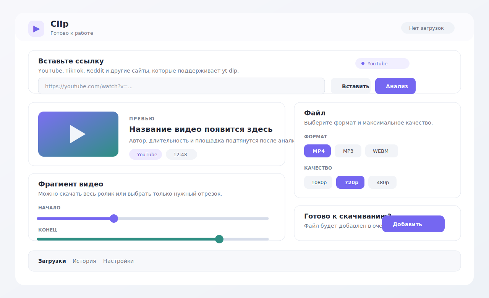
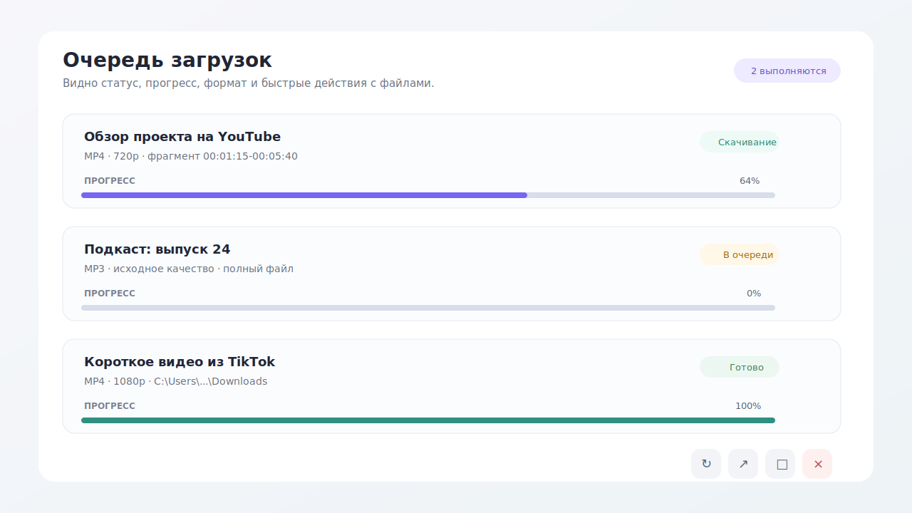
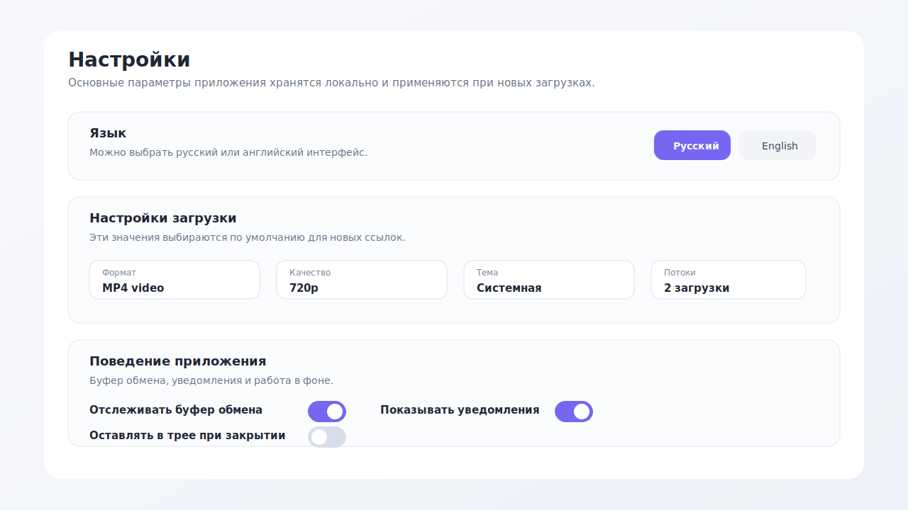

# Clip

Clip - это Windows-приложение для скачивания видео и аудио по ссылке. Оно помогает быстро сохранить ролик, выбрать качество, скачать только нужный фрагмент и не искать `yt-dlp` или `ffmpeg` вручную.

Приложение сделано на C# 12, .NET 8, WinUI 3 и Windows App SDK.

## Скриншоты

### Главный экран



На главном экране пользователь вставляет ссылку, запускает анализ, видит превью ролика и выбирает параметры файла.

### Очередь загрузок



В очереди видно текущий статус, прогресс, формат, качество и быстрые действия: отменить, повторить, открыть файл или папку.

### Настройки



В настройках можно выбрать язык, формат по умолчанию, качество, количество одновременных загрузок, уведомления и поведение приложения в трее.

## Что умеет Clip

- скачивает видео по ссылке;
- поддерживает YouTube, TikTok, Reddit, X, Instagram и другие сайты, которые умеет обрабатывать `yt-dlp`;
- показывает превью видео после анализа ссылки;
- даёт выбрать формат: видео или аудио;
- даёт выбрать качество: например 1080p, 720p или ниже;
- умеет скачивать не весь ролик, а выбранный фрагмент;
- показывает очередь загрузок и прогресс;
- хранит историю завершённых загрузок;
- умеет использовать cookies браузера для роликов с ограниченным доступом;
- работает как portable-приложение без установки.

## Как скачать и запустить

Для обычного пользователя нужен ZIP из раздела **Releases**.

Не скачивайте проект через `Code > Download ZIP`, если хотите просто запустить программу. Этот архив содержит исходный код, а не готовое приложение.

Правильный вариант:

1. Открыть раздел **Releases** на GitHub.
2. Скачать файл `Clip-win-x64.zip`.
3. Распаковать архив в удобную папку.
4. Запустить `Start Clip.cmd` или `Clip.exe`.

В релизном архиве `Clip.exe` лежит сразу в верхнем уровне папки. Его не нужно искать внутри `bin`, `Release`, `Debug` или других служебных каталогов.

## Как пользоваться

1. Скопируйте ссылку на видео.
2. Вставьте ссылку в поле **Вставьте ссылку**.
3. Нажмите **Анализ**.
4. Проверьте превью и длительность ролика.
5. Выберите формат и качество.
6. При необходимости включите скачивание фрагмента и задайте начало и конец.
7. Нажмите **Добавить в загрузки**.

После завершения файл можно открыть из приложения или найти в выбранной папке сохранения.

## Для кого это приложение

Clip подойдёт, если нужно быстро сохранить видео или аудио без командной строки. Приложение использует мощные инструменты внутри, но показывает их через обычный интерфейс Windows.

## Для разработчиков

Перед запуском из исходников нужно скачать внешние инструменты:

```powershell
.\scripts\Download-Binaries.ps1
```

После этого можно собрать и запустить проект:

```powershell
dotnet restore
dotnet build -c Debug
dotnet run --project Clip
```

## Сборка релизного ZIP

```powershell
powershell -ExecutionPolicy Bypass -File .\scripts\Build-PortableRelease.ps1
```

Скрипт создаёт архив:

```text
release/Clip-win-x64.zip
```

Этот ZIP можно прикрепить к GitHub Release. Внутри архива есть `Start Clip.cmd`, `Clip.exe` и все нужные файлы для запуска.

## Что не хранится в репозитории

В репозиторий не добавляются:

- файлы сборки `bin`, `obj`, `release`;
- `ffmpeg.exe`, `ffprobe.exe`, `yt-dlp.exe`;
- локальные настройки IDE;
- временные файлы и архивы.

Эти файлы либо создаются при сборке, либо скачиваются скриптом.

## Откат учебного PR

Если изменения из демонстрационного PR больше не нужны, их можно убрать одним revert-коммитом:

```powershell
git checkout main
git pull origin main
git revert HEAD
git push origin main
```
